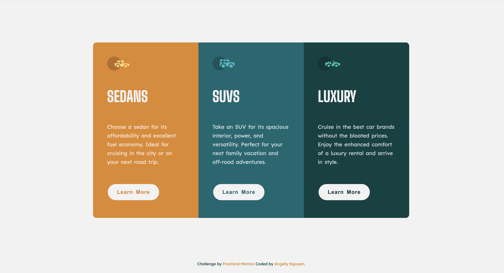
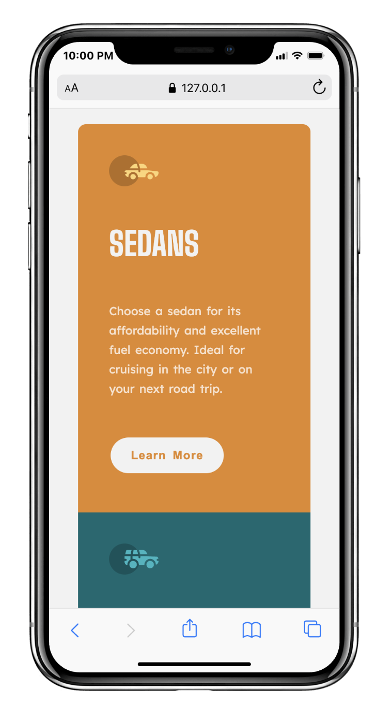

# Frontend Mentor - 3-column preview card component solution

This repository contains a completed solution to the [3-column preview card component challenge on Frontend Mentor](https://www.frontendmentor.io/challenges/3column-preview-card-component-pH92eAR2-).

## Table of contents

- [Overview](#overview)
  - [The challenge](#the-challenge)
  - [Screenshot](#screenshot)
  - [Links](#links)
- [My process](#my-process)
  - [Built with](#built-with)
  - [What I learned](#what-i-learned)
  - [Continued development](#continued-development)
  - [Useful resources](#useful-resources)
  - [AI Collaboration](#ai-collaboration)
- [Author](#author)
- [Acknowledgments](#acknowledgments)

## Overview

### The challenge

Create a responsive 3-column preview card component that uses distinct styling for Sedans, SUVs, and Luxury cars. The design should respond gracefully to mobile, tablet, and desktop screen sizes, and each card should include a visible hover state for the action button.

### Screenshot

Desktop preview:

Mobile preview:

### Links

- [Solution URL](https://github.com/kyduyennguyen/frontendmentor/tree/main/3-column-preview-card-component-main)
- [Live Site URL](https://kyduyennguyen.github.io/frontendmentor/3-column-preview-card-component-main/index.html)

## My process

### Built with

- Semantic HTML5 structure
- Responsive CSS Grid layout
- Mobile-first media queries
- CSS hover states for buttons
- Google Fonts: Big Shoulders and Lexend Deca

### What I learned

This project reinforced responsive layout and card styling through a simple CSS-driven solution.

Highlights:

- using `display: grid` to build a stable three-column layout for desktop
- stacking cards vertically for phone and tablet breakpoints with media queries
- applying consistent card padding, typography, and color themes for each card type
- adding interactive hover states for the "Learn More" buttons

### Continued development

Possible enhancements for future iterations:

- add smooth transition effects for button hover states
- improve accessibility by including keyboard focus styles and ARIA attributes
- implement a dark theme toggle or card activation state with JavaScript
- deploy the page to GitHub Pages or another static hosting provider

### Useful resources

- [Frontend Mentor challenge page](https://www.frontendmentor.io/challenges/3column-preview-card-component-pH92eAR2-) - challenge description and design assets.
- [CSS Grid Layout](https://developer.mozilla.org/en-US/docs/Web/CSS/CSS_Grid_Layout) - used for the responsive card layout.
- [Media queries](https://developer.mozilla.org/en-US/docs/Web/CSS/Media_Queries) - used for responsive breakpoint behavior.

### AI Collaboration

I used GitHub Copilot to help structure and refine the README content.

## Author

- Github - [Angelly Nguyen](https://github.com/kyduyennguyen)
- Frontend Mentor - [@kyduyennguyen](https://www.frontendmentor.io/profile/kyduyennguyen)
- LinkedIn - [Duyen Nguyen](https://www.linkedin.com/in/duyen-dk-nguyen/)

## Acknowledgments

- Frontend Mentor for the challenge and design guidance.
- Google Fonts for typography resources.
- This project was completed as practice to improve responsive layout skills.
