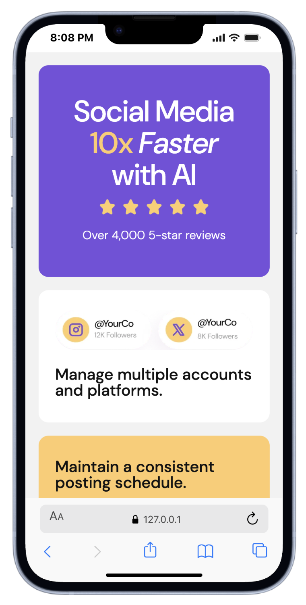

# Frontend Mentor - Bento grid solution

This is a solution to the [Bento grid challenge on Frontend Mentor](https://www.frontendmentor.io/challenges/bento-grid-RMydElrlOj). Frontend Mentor challenges help you improve your coding skills by building realistic projects.

## Table of contents

- [Overview](#overview)
  - [The challenge](#the-challenge)
  - [Screenshot](#screenshot)
  - [Links](#links)
- [My process](#my-process)
  - [Built with](#built-with)
  - [What I learned](#what-i-learned)
  - [Continued development](#continued-development)
  - [Useful resources](#useful-resources)
- [Author](#author)

## Overview

### The challenge

Users should be able to:

- View the optimal layout for the interface depending on their device's screen size

### Screenshot




### Links

- Solution URL: [My solution for this challenge](https://github.com/kyduyennguyen/frontendmentor/tree/main/bento-grid-main)
- Live Site URL: [Bento Grid Main page](https://kyduyennguyen.github.io/frontendmentor/bento-grid-main/index.html)

## My process

### Built with

- Semantic HTML5 markup
- CSS custom properties
- Flexbox
- CSS Grid
- Responsive Web Design - Media Queries [by w3schools page](https://www.w3schools.com/css/css_rwd_mediaqueries.asp)

### What I learned

- Mastering **`CSS Grid`** to structure web layouts, including defining column/row templates and managing grid properties effectively.
- Implementing **`Responsive Web Design (RWD)`** principles using Media Queries to ensure a seamless experience across mobile devices.
- Utilizing **`CSS Flexbox`** for precise item alignment and positioning, including techniques for perfect centering and flexible distributions.

To see how you can add code snippets, see below:

```CSS Flexbox
main {
	background-color: hsl(0, 0%, 95%);
	display: flex;
	justify-content: center;
	align-items: center;
}
```

```CSS Grid
#bento-grid-main {
	display: grid;
    grid-template-columns: auto;
	grid-template-rows: auto auto;
}

.section-left {
	grid-row: 2;
}

.section-right {
	grid-row: 1;
}
```

```CSS RWD
@media screen and (max-width: 440px) and (min-width: 320px) {
    #bento-grid-main {
		display: block;
		width: 360px;
		margin-left: 10px;
		margin-right: 0;
	}
}
```

### Continued development

- Since this challenge focuses solely on using **HTML and CSS** to display information and images, there are no plans for further development. This project served as a great exercise to reinforce my understanding of **`CSS Grid and Flexbox`** for structuring web layouts.

### Useful resources

- [CSS Flexbox](https://www.w3schools.com/css/css3_flexbox.asp) - This helped me for **CSS Flexbox**.
- [CSS Grid](https://www.w3schools.com/css/css_grid.asp) - This helped me visualize and implement complex **CSS Grid** structures.
- [CSS Properties](https://www.w3schools.com/cssref/pr_grid.php) - This was an excellent reference for quickly looking up and understanding various **CSS Grid properties**.
- [CSS RWD - Media Queries](https://www.w3schools.com/css/css_rwd_mediaqueries.asp) - This guide helped me understand the **Mobile-First** approach and how to effectively use Media Queries to optimize layouts for handheld devices.

## Author

- Github - [Angelly Nguyen](https://github.com/kyduyennguyen)
- Frontend Mentor - [@kyduyennguyen](https://www.frontendmentor.io/profile/kyduyennguyen)
- Linkedin - [Duyen Nguyen](https://www.linkedin.com/in/duyen-dk-nguyen/)
