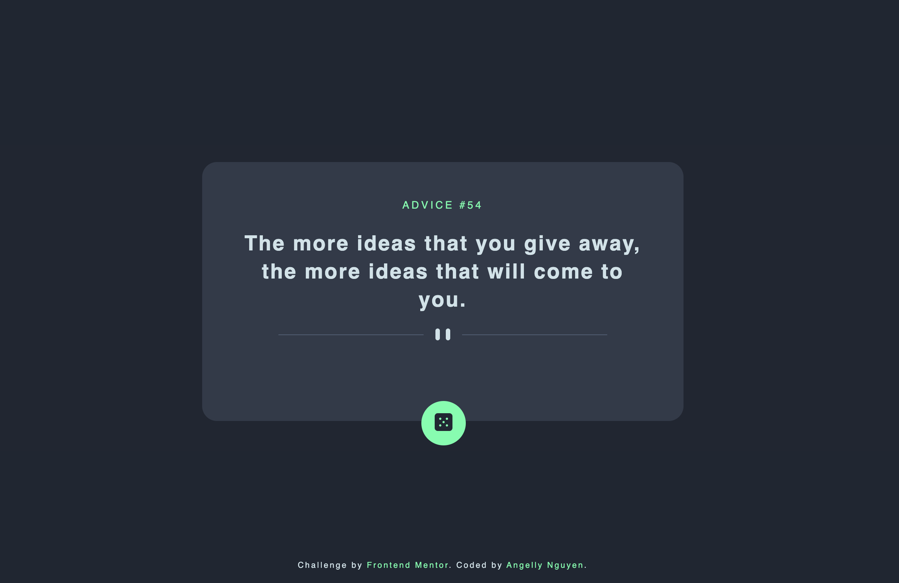
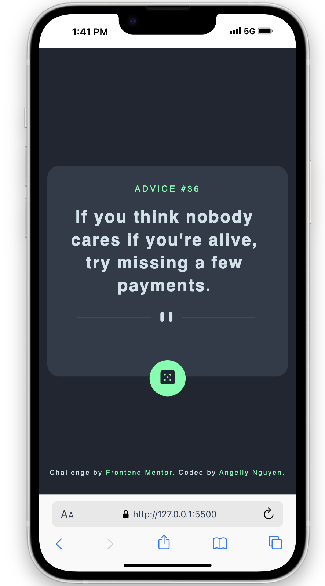

# Frontend Mentor - Advice generator app solution

This is a solution to the [Advice generator app challenge on Frontend Mentor](https://www.frontendmentor.io/challenges/advice-generator-app-QdUG-13db). Frontend Mentor challenges help you improve your coding skills by building realistic projects.

## Table of contents

- [Overview](#overview)
  - [The challenge](#the-challenge)
  - [Screenshot](#screenshot)
  - [Links](#links)
- [My process](#my-process)
  - [Built with](#built-with)
  - [What I learned](#what-i-learned)
- [Author](#author)

## Overview

### The challenge

Users should be able to:

- View the optimal layout for the app depending on their device's screen size
- See hover states for all interactive elements on the page
- Generate a new piece of advice by clicking the dice icon

### Screenshot




### Links

- Solution URL: [My Solution]()
- Live Site URL: [Live site]()

## My process

### Built with

- Semantic HTML5 markup
- CSS custom properties
- JavaScript

### What I learned

With this project, I learned how to connect to third-party API to get data

To see how you can add code snippets, see below:

```js
function showQuotes() {
	fetch("https://api.adviceslip.com/advice")
		.then((response) => response.json())
		.then((data) => data.slip)
		.then((data) => {
			adviceNum.textContent = data.id;
			adviceText.textContent = data.advice;
		})
		.catch((error) => {
			alert(`Error ${error}`);
		});
}
```

## Author

- Github - [Angelly Nguyen](https://github.com/kyduyennguyen)
- Frontend Mentor - [@kyduyennguyen](https://www.frontendmentor.io/profile/kyduyennguyen)
- LinkedIn - [Duyen Nguyen](https://www.linkedin.com/in/duyen-dk-nguyen/)
