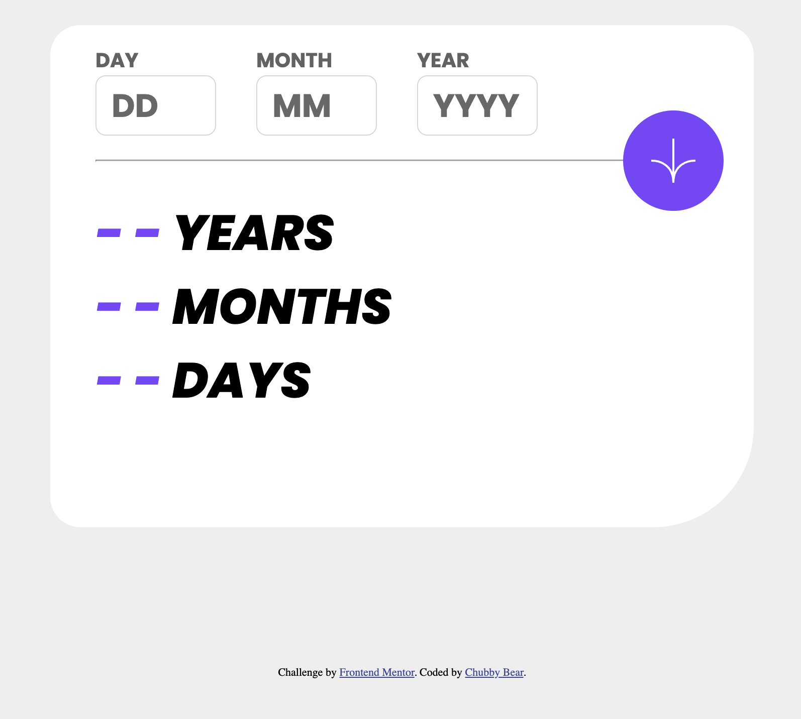
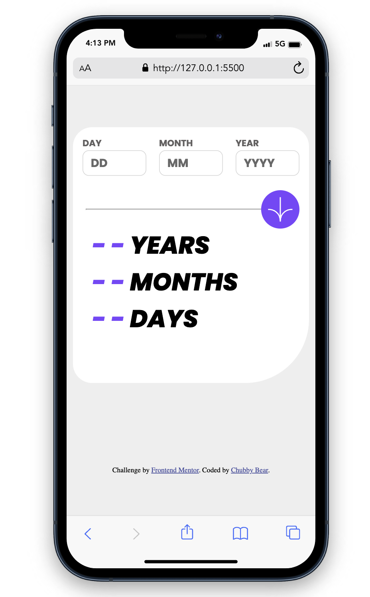

# Frontend Mentor - Age calculator app solution

This is a solution to the [Age calculator app challenge on Frontend Mentor](https://www.frontendmentor.io/challenges/age-calculator-app-dF9DFFpj-Q). Frontend Mentor challenges help you improve your coding skills by building realistic projects.

## Table of contents

- [Overview](#overview)
  - [The challenge](#the-challenge)
  - [Screenshot](#screenshot)
  - [Links](#links)
- [My process](#my-process)
  - [Built with](#built-with)
  - [What I learned](#what-i-learned)
  - [Continued development](#continued-development)
  - [Useful resources](#useful-resources)
- [Author](#author)

## Overview

### The challenge

Users should be able to:

- View an age in years, months, and days after submitting a valid date through the form
- Receive validation errors if:
  - Any field is empty when the form is submitted
  - The day number is not between 1-31
  - The month number is not between 1-12
  - The year is in the future
  - The date is invalid e.g. 31/04/1991 (there are 30 days in April)
- View the optimal layout for the interface depending on their device's screen size
- See hover and focus states for all interactive elements on the page

### Screenshot

- Screen view of Web: 
- Screen view of Mobile: 

### Links

- Live Site URL: [Age Calculator App](https://kyduyennguyen.github.io/frontendmentor/age-calculator-app-main/index.html)
- Figma Source: [](./figma/)

## My process

### Built with

- [Semantic HTML5 markup](https://www.w3schools.com/html/)
- [Styled Components](./style-guide.md): For styles
- [CSS custom properties](https://www.w3schools.com/css/)
  - @font-face
  - CSS Grid, Flex, Box-sizing
  - Position
  - Form: Label, Input
  - Fonts, Text
  - Border
  - Margin, Padding
  - Responsive for Mobile web
- [JavaScript](https://www.w3schools.com/js/): To program the behavior of web page
  - Use Strict mode
  - Functions
  - If else loop
  - Objects
  - Date, Format Date
  - Arrays
  - DOM Document, DOM HTML, DOM Events

### What I learned

I learnt and known how to make the Age Calculator App with JavaScript. And how to make design for calculator app with HTML and CSS.

To see how you can add code snippets, see below:

```html
<section id="date">
  <div class="input-date">
    <label for="day" id="label-day">DAY</label><br />
    <input
      type="text"
      id="input-day"
      name="day"
      placeholder="DD"
      minlength="1"
      maxlength="2"
      onblur="updateDay()"
    /><br />
    <span id="error-day" class="error-box"></span>
  </div>
  <div class="input-date">
    <label for="month" id="label-month">MONTH</label><br />
    <input
      type="text"
      id="input-month"
      name="month"
      placeholder="MM"
      minlength="1"
      maxlength="2"
      onblur="updateMonth()"
    /><br />
    <span id="error-month" class="error-box"></span>
  </div>
  <div class="input-date">
    <label for="year" id="label-year">YEAR</label><br />
    <input
      type="text"
      id="input-year"
      name="year"
      placeholder="YYYY"
      minlength="4"
      maxlength="4"
      onblur="updateYear()"
    /><br />
    <span id="error-year" class="error-box"></span>
  </div>
</section>
<section id="line-button">
  <hr />
  <button id="btn-input" onclick="calculateAge()">
    <svg
      xmlns="http://www.w3.org/2000/svg"
      width="46"
      height="44"
      viewBox="0 0 46 44"
    >
      <g fill="none" stroke="#FFF" stroke-width="2">
        <path
          d="M1 22.019C8.333 21.686 23 25.616 23 44M23 44V0M45 22.019C37.667 21.686 23 25.616 23 44"
        />
      </g>
    </svg>
  </button>
</section>
<section id="result-contents">
  <h1 class="result-text"><span id="result-years">- -</span> YEARS</h1>
  <h1 class="result-text"><span id="result-months">- -</span> MONTHS</h1>
  <h1 class="result-text"><span id="result-days">- -</span> DAYS</h1>
</section>
```

```css
/* Please see in styles folder. You will see 2 files: style.css (for page) and mobile-style.css (for mobile) */
```

```js
// Below just calculateAge function, if you want to see more please find code in script.js file
const calculateAge = function () {
  day = Number(document.getElementById('input-day').value);
  month = Number(document.getElementById('input-month').value);
  year = Number(document.getElementById('input-year').value);
  let today = new Date();

  console.log(`${day}-${month}-${year}`);
  let inputDate = new Date(year, month, day);
  let birthDetails = {
    day: inputDate.getDate(),
    month: inputDate.getMonth() + 1,
    year: inputDate.getFullYear(),
  };

  // Declare variables for current DATE (it means today)
  let currentDay = today.getDate();
  let currentMonth = today.getMonth() + 1;
  let currentYear = today.getFullYear();

  // Cheking current year is leap year???
  leapChecker(currentYear);

  // Checking invalid date
  if (
    birthDetails.year > currentYear ||
    (birthDetails.month > currentMonth && birthDetails.year == currentYear) ||
    (birthDetails.day > currentDay &&
      birthDetails.month == currentMonth &&
      birthDetails.year == currentYear)
  ) {
    alert('Not born yet!!!');
    displayResults('- -', '- -', '- -');
    return;
  }

  // calculating Years
  birthYear = currentYear - birthDetails.year;
  console.log(birthYear);

  // calculating Months
  if (currentMonth >= birthDetails.month) {
    birthMonth = currentMonth - birthDetails.month;
  } else {
    birthYear--;
    birthMonth = 12 + (currentMonth - birthDetails.month);
  }

  // calculating Days
  if (currentDay >= birthDetails.day) {
    birthDay = currentDay - birthDetails.day;
  } else {
    let days = months[currentMonth - 1];
    birthDay = days + currentDay - birthDetails.day;
    if (birthMonth < 0) {
      birthMonth = 11;
      birthYear--;
    }
  }

  // View an age in years, months and days
  displayResults(birthDay, birthMonth, birthYear);
};
```

### Continued development

- Add conditions for calculate function after click button if any fields is error, it cannot execute.

### Useful resources

- [Age Calculator](https://www.calculator.net/age-calculator.html) - This supported me find the Formula of Age calculator for my app.

## Author

- Github - [Chubby Bear](https://github.com/kyduyennguyen)
- Frontend Mentor - [@kyduyennguyen](https://www.frontendmentor.io/profile/kyduyennguyen)
- Linkedin - [Duyen Nguyen](https://www.linkedin.com/in/duyen-nguyen-5b6782146/)
