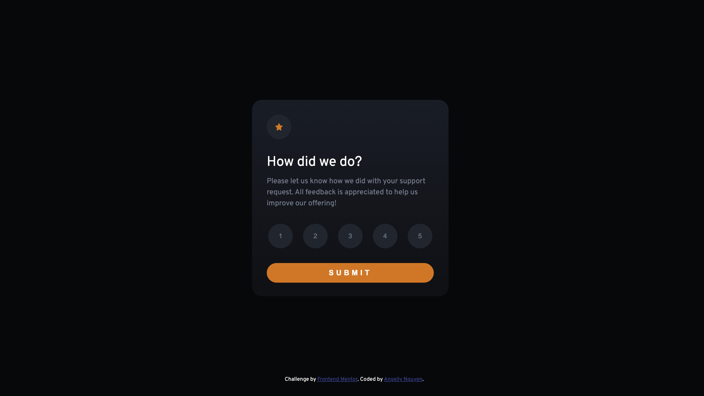
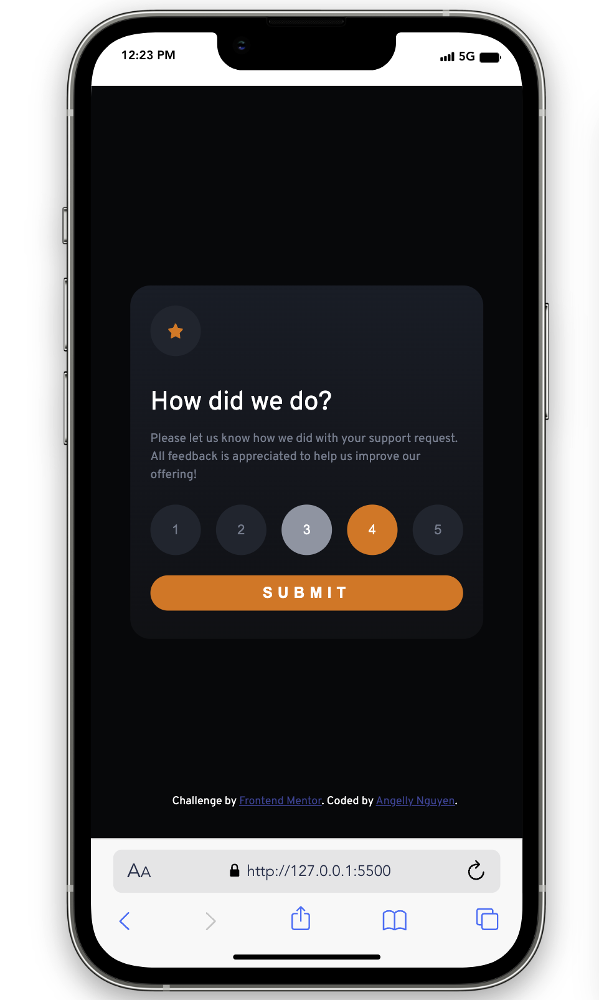

# Frontend Mentor - Interactive rating component solution

Thanks for watching my coding. This is the coding challenge of [Frontend Mentor](https://www.frontendmentor.io/), it helps you improve your coding skills by building projects.

**To do this challenge, you need a basic understanding of HTML, CSS and JavaScript.**

## Table of contents

- [Overview](#overview)
  - [The challenge](#the-challenge)
  - [Screenshot](#screenshot)
  - [Links](#links)
- [My process](#my-process)
  - [Built with](#built-with)
  - [What I learned](#what-i-learned)
- [Author](#author)

## Overview

### The challenge

This challenge is to build out the interactive rating component and keeping it as near to the design as possible.

I use VS Code tools to complete the challenge. But if you've got other tools you'd like to practice, feel free to give it a go.

Make sure Users could:

- View the optimal layout for the app depending on their device's screen size
- See hover states for all interactive elements on the page
- Select and submit a number rating
- See the "Thank you" card state after submitting a rating

### Screenshot

These are screenshots and figma design of my solution:

**You can see more in [design folder](./design/)**

### Links

- Solution URL: https://github.com/kyduyennguyen/frontendmentor/tree/main/interactive-rating-component-main
- Live Site URL: https://kyduyennguyen.github.io/frontendmentor/interactive-rating-component-main/index.html

## My process

### Built with

- Semantic HTML5 markup
- CSS custom properties
- CSS Grid
- Mobile-first workflow
- [Styled Components](./css/) - For styles
- [JavaScript](./js/)

### What I learned

I could know how to add events for rating buttons when choose them. And I learned about showing/hiding the boxes/frames when click submit button in JS.

## Author

- Github - [Angelly Nguyen](https://github.com/kyduyennguyen)
- Frontend Mentor - [@kyduyennguyen](https://www.frontendmentor.io/profile/kyduyennguyen)
- Linkedin - [Duyen Nguyen](https://www.linkedin.com/in/duyen-dk-nguyen/)
