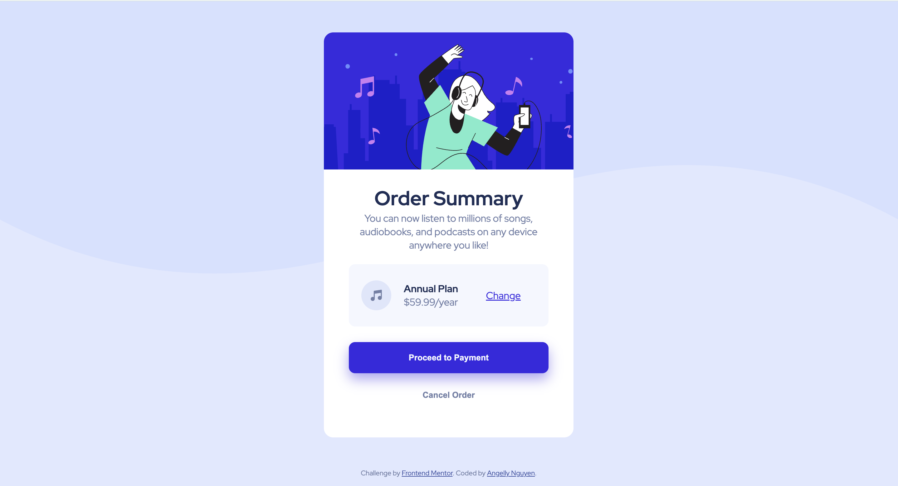
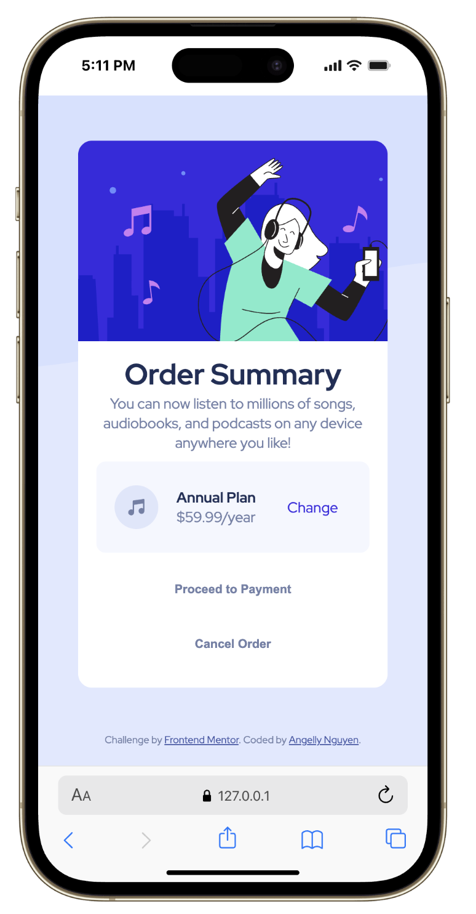

# Frontend Mentor - Order Summary Card

This is my solution to the [Order summary card challenge on Frontend Mentor](https://www.frontendmentor.io/challenges/order-summary-component-QlPmajDUj).

## Table of contents

- [Overview](#overview)
  - [The challenge](#the-challenge)
  - [Screenshot](#screenshot)
  - [Links](#links)
- [My process](#my-process)
  - [Built with](#built-with)
  - [What I learned](#what-i-learned)
  - [Continued development](#continued-development)
  - [Useful resources](#useful-resources)
  - [AI Collaboration](#ai-collaboration)
- [Author](#author)
- [Acknowledgments](#acknowledgments)

## Overview

### The challenge

Build a responsive order summary card that matches the design and includes hover states for interactive elements.

This project includes:

- a hero illustration banner
- a title and supporting description
- a plan summary card with a change link
- primary and secondary button actions
- desktop and mobile responsive layouts

### Screenshot

Desktop preview:

Mobile preview:

### Links

- Solution URL: [My Solution](https://github.com/kyduyennguyen/frontendmentor/tree/main/order-summary-component-main)
- Live Site URL: [Order Summary Card](https://kyduyennguyen.github.io/frontendmentor/order-summary-component-main/index.html)

## My process

### Built with

- Semantic HTML5 markup
- CSS3
- Flexbox
- CSS Grid
- Mobile-first responsive design
- Google Fonts

### What I learned

Working on this challenge helped me improve the structure and spacing of a centered component card.

I learned how to:

- organize content using semantic sections and descriptive IDs
- use CSS Grid to align elements inside the plan card
- use responsive media queries for mobile and desktop layouts
- style interactive hover states for links and buttons

### Continued development

In future versions I want to:

- add keyboard focus states for accessibility
- improve the hover transition timing and button animations
- support more screen widths with fluid sizing
- make the "Change" action actually update the selected plan

### Useful resources

- [Frontend Mentor](https://www.frontendmentor.io) - challenge reference and design file
- [MDN Web Docs: CSS Grid](https://developer.mozilla.org/en-US/docs/Web/CSS/CSS_Grid_Layout)
- [CSS RWD - Media Queries](https://www.w3schools.com/css/css_rwd_mediaqueries.asp) - This guide helped me understand the **Mobile-First** approach and how to effectively use Media Queries to optimize layouts for handheld devices.

### AI Collaboration

- No AI tools were used during this project.

## Author

- Github - [Angelly Nguyen](https://github.com/kyduyennguyen)
- Frontend Mentor - [@kyduyennguyen](https://www.frontendmentor.io/profile/kyduyennguyen)
- Linkedin - [Duyen Nguyen](https://www.linkedin.com/in/duyen-dk-nguyen/)

## Acknowledgments

- Thanks to Frontend Mentor for the challenge and the design inspiration.
