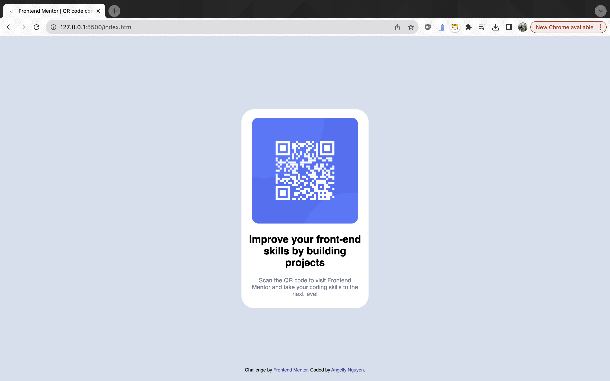
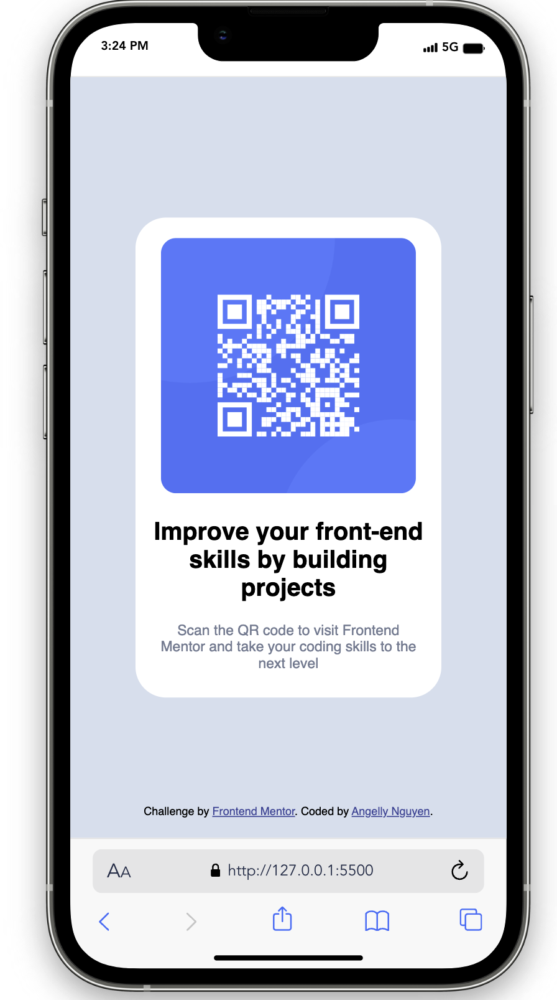

# Frontend Mentor - QR code component solution

This is a solution to the [QR code component challenge on Frontend Mentor](https://www.frontendmentor.io/challenges/qr-code-component-iux_sIO_H). Frontend Mentor challenges help you improve your coding skills by building realistic projects.

## Table of contents

- [Overview](#overview)
  - [Screenshot](#screenshot)
  - [Links](#links)
- [My process](#my-process)
  - [Built with](#built-with)
  - [What I learned](#what-i-learned)
  - [Continued development](#continued-development)
  - [Useful resources](#useful-resources)
- [Author](#author)
- [Acknowledgments](#acknowledgments)

**Note: Delete this note and update the table of contents based on what sections you keep.**

## Overview

### Screenshot

### Links

- Live Site URL: [QR Code Component Main](https://kyduyennguyen.github.io/frontendmentor/qr-code-component-main/index.html)

## My process

### Built with

- Semantic HTML5 markup
- CSS custom properties
- Mobile-first workflow
- [Styled Components](https://www.w3schools.com/css/default.asp) - For styles

### What I learned

I learned how HTML elements are to be displayed on screen or in other media. And how to use external stylesheets are stored in CSS file. Besides, I known how to set position for elements.

### Continued development

I'm going to update my QR code and set color for background because I think current background color is too dark. And edit contents of guideline below QR code.

## Author

- Github - [Angelly Nguyen](https://github.com/kyduyennguyen)
- Frontend Mentor - [@kyduyennguyen](https://www.frontendmentor.io/profile/kyduyennguyen)
- Linkedin - [Duyen Nguyen](https://www.linkedin.com/in/duyen-dk-nguyen/)
