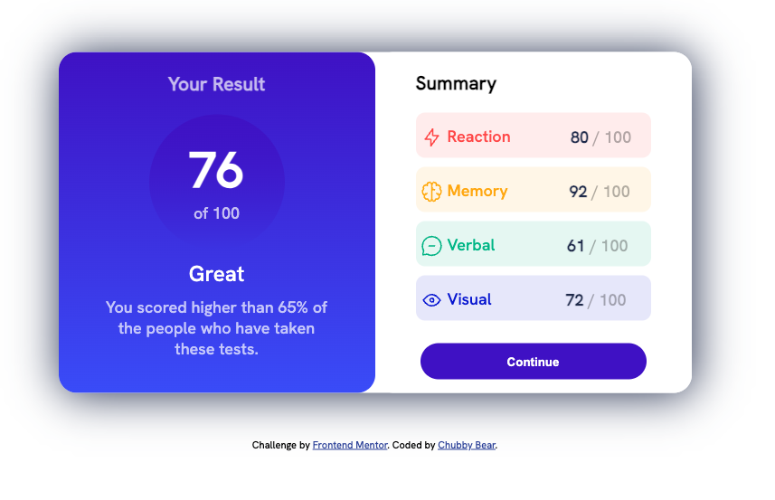
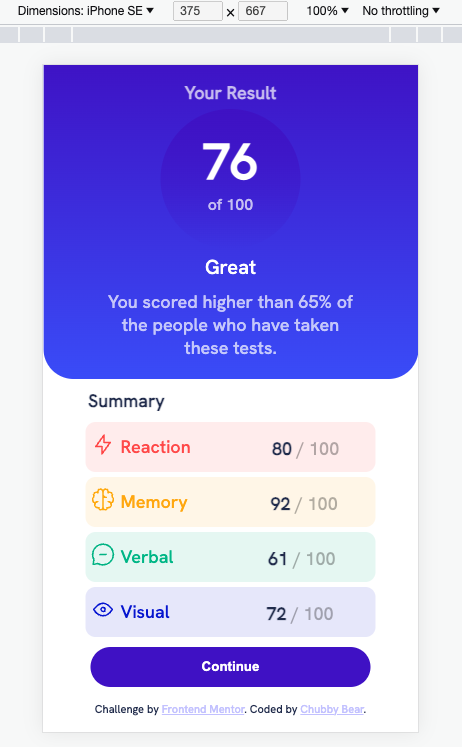

# Frontend Mentor - Results summary component solution

This is a solution to the [Results summary component challenge on Frontend Mentor](https://www.frontendmentor.io/challenges/results-summary-component-CE_K6s0maV). Frontend Mentor challenges help you improve your coding skills by building realistic projects.

## Table of contents

- [Overview](#overview)
  - [The challenge](#the-challenge)
  - [Screenshot](#screenshot)
  - [Links](#links)
- [My process](#my-process)
  - [Built with](#built-with)
  - [What I learned](#what-i-learned)
  - [Useful resources](#useful-resources)
- [Author](#author)

## Overview

### The challenge

Users should be able to:

- View the optimal layout for the interface depending on their device's screen size
- See hover and focus states for all interactive elements on the page

### Screenshot

- Design of laptop and tablet web view: 
- Design of mobile web view: 

### Links

- Live Site URL: [Add live site URL here]
- Figma Design Source: 

## My process

### Built with

- Semantic HTML5 markup
- CSS custom properties
- CSS Grid
- Responsive for Mobile web
- For styles:
  - [Styled Components](./style-guide.md)
  - [Figma Design](./Figma/Layout%20for%20Mobile%20and%20Laptop%20Web%20pages.pdf)

### What I learned

```html
<div class="contents grid-container">
  <!--I learned about Grid Layout-->
  <div class="result-table grid-items item1">
    <!--Create some elements for Result Table-->
  </div>
  <div class="summary-table grid-items item2">
    <!--Create some elements for Result Table-->
  </div>
</div>
```

```css
.grid-container {
  display: grid;
  grid-template-columns: 300px 300px;
  box-shadow: 2px 2px 50px hsl(224, 30%, 27%);
  text-align: center;
  width: 700px;
}

.grid-items {
  border-radius: 20px;
}

.item1 {
  grid-column-end: 1;
}
```

- Besides, I learned how to apply CSS Responsive for website (Responsive web design makes my web page look good on all Mobile devices). You can see it in [style-mobile file](./css/style-mobile.css)

### Useful resources

- [CSS Responsive](https://www.w3schools.com/css/css_rwd_intro.asp) - This helped me for know how make my website look on Mobile devices screen.
- [Grid Layout](https://www.w3schools.com/css/css_grid.asp) - This is an amazing article which helped me finally understand Grid Layout. I'd recommend it to anyone still learning this concept.

## Author

- Github - [Chubby Bear](https://github.com/kyduyennguyen)
- Frontend Mentor - [@kyduyennguyen](https://www.frontendmentor.io/profile/kyduyennguyen)
- Linkedin - [Duyen Nguyen](https://www.linkedin.com/in/duyen-nguyen-5b6782146/)
