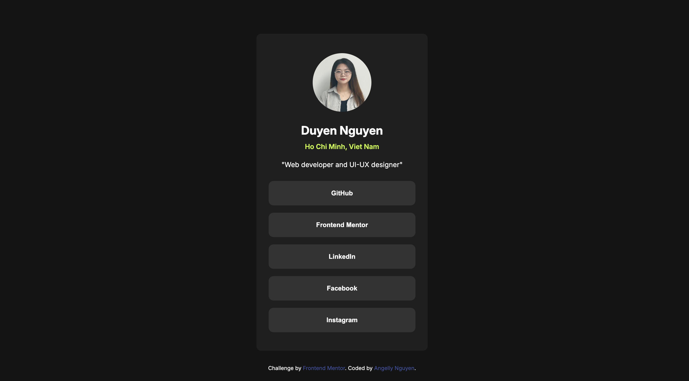
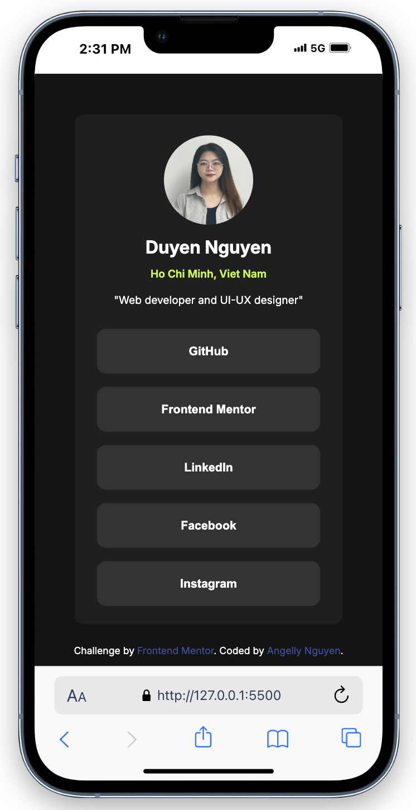

# Frontend Mentor - Social links profile solution

Thanks for watching my coding. This is a solution to the [Social links profile challenge on Frontend Mentor](https://www.frontendmentor.io/challenges/social-links-profile-UG32l9m6dQ). Frontend Mentor challenges help you improve your coding skills by building realistic projects.

## Table of contents

- [Overview](#overview)
  - [The challenge](#the-challenge)
  - [Screenshot](#screenshot)
  - [Links](#links)
- [My process](#my-process)
  - [Built with](#built-with)
  - [Continued development](#continued-development)
- [Author](#author)

## Overview

### The challenge

This challenge is to build social links profile. It will show avatar, name, address, job-title and social links.

Users should be able to:

- See hover and focus states for all interactive elements on the page

### Screenshot

These are screenshots of my solution:

### Links

- Solution URL: [Add solution URL here](https://your-solution-url.com)
- Live Site URL: [Add live site URL here](https://your-live-site-url.com)

## My process

### Built with

- Semantic HTML5 markup
- CSS custom properties
- CSS Grid
- Mobile-first workflow

### Continued development

I will change color for page, maybe I will choose bright colors. And add more info like phone-number, email,...

## Author

- Website - [Angelly Nguyen](https://github.com/kyduyennguyen)
- Frontend Mentor - [@kyduyennguyen](https://www.frontendmentor.io/profile/kyduyennguyen)
- LinkedIn - [Duyen Nguyen](https://www.linkedin.com/in/duyen-dk-nguyen/)
